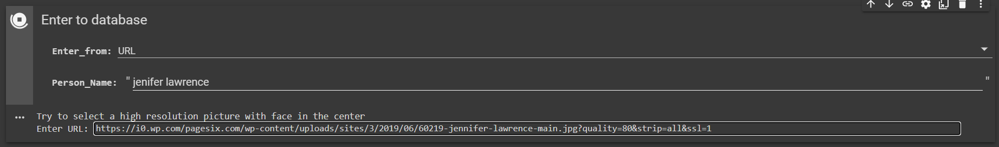
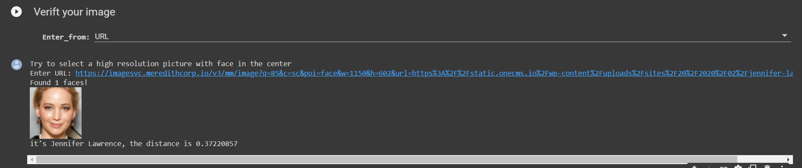

# Face_Detection

This is just for fun so do not start getting your hope ups, but its worth giving a try.

If have a prior experience with Jyputer Notebooks, go ahead see the code.

<a href="https://colab.research.google.com/github/LordHarsh/Face_Detection/blob/main/Face_Recognition_v3a.ipynb" target="_blank" rel="noopener noreferrer">
  
</a>


### Step by step
If you are new to Jupyter Notebooks then open the notebook from the button given below and see this step by step guide-
* When notebook opens, click on ```Runtime``` and select ```Run all```.
>> Each box appearing in the workspace is known as a cell. This option will rull all cells one by one.


* If you want to rull each cell manually use ```shift+Enter```.
* When this is done, you will see two forms at the end.
* First form is to enter a person's picture in database. You can do this by entering the URL (image address) of a image or by uploading the picture from your local PC. You also have to enter name of person so it can be saved in the database.
>> **Note-** Make sure there is a ```http``` or ```https``` in the URL.



* Second form is where it tries to recognize the person. Here, you have have to enter the URL of image or just upload it.



### How this works-
* First we us OpenCV to find faces.
* Crop out the faces.
* Use an algoritm to give encoding for each face in form of 128 element array.
* If person in two pictures is same, their encodings will be similar otherwise the difference of encodings of two pictures will be large.

This algoritm is inspired from [FaceNet](https://arxiv.org/pdf/1503.03832.pdf) and [DeepFace](https://research.fb.com/wp-content/uploads/2016/11/deepface-closing-the-gap-to-human-level-performance-in-face-verification.pdf)
Try reading these papers, FaceNet is pretty simple.
You know, FaceNet is developed by Google.

### Make sures-
1. The picture has only one face
2. The picure is of high resolution
3. Major portion of the picture contains face so the algoritm can find a face.

### If the result is wrong
* If the result is wrong then it's not anything wrong our code or your method.
* It's because it machine learning model used here to recognize faces is a weekly trained. This is due to current lack of computing resourses and face data. This will be fixed in the future.

### Possible Future
* In some time I will add a better face recognition model.
* Make model handel different lighting conditions.
* Do web scrapping to save a database (image along with endodings) of a lot of of famous personalities (actors and actresses first).
* If there is a suggesting tell me using issues.


<a href="https://colab.research.google.com/github/LordHarsh/Face_Detection/blob/main/Face_Recognition_v3a.ipynb"  target="_blank" rel="noopener noreferrer">
  
</a>

